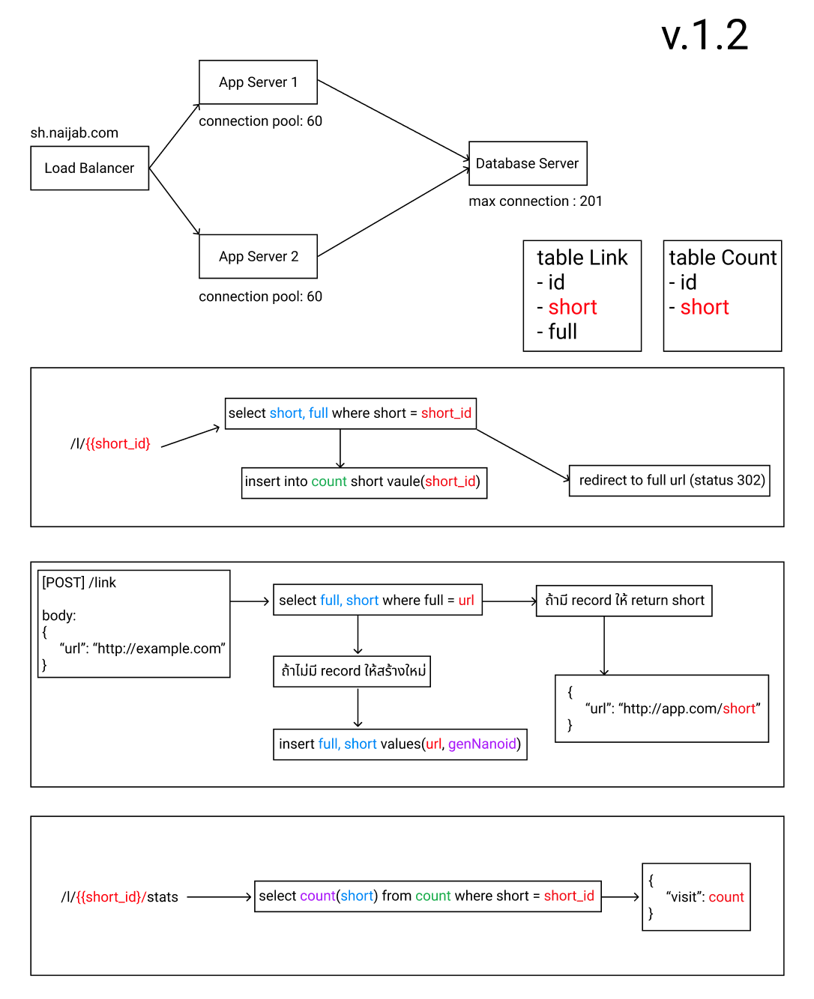

# homework-2-deno

> URL Shortener API's with Deno and MariaDB

## System Architecture

## Tag Version
- `make fetch-version` for fetching all tags
- `make list-version` for listing all tag
- `git checkout <tag name>` for checkout tag version

## Must install
- `sudo apt install make` for installing make
- `make install-deno` for installing deno (for local development)
- `make install-docker` for installing docker 
- `make install-docker-compose` for installing docker-compose

## How to run
- copy **.env.example** to **.env** and edit value and use `source .env`
- if database machine edit onlye `DB_PASSWORD` value for initialize database container

- `make install` for installing deno
- `make install-docker` for installing docker
- `make start-db-docker` for starting database (only use on database machine) -- port 3307 default
- `make start-app-docker` for starting app (only use on app machine) -- port 8080 default
- `make stop-app-docker` for stoping app docker
- `make stop-db-docker` for stoping database docker
- `make lint` for linting of code

## App
- `make start` for starting local app [http://localhost](http://localhost) port can edit in .env file
- `make build-app-docker` for running re-build docker container
- `make status-app-docker` for checking status of app container docker
- `make restart-app-docker` for restarting app without build (use only when update .env)
- [http://localhost](http://localhost) or [http://sh.naijab.com](http://sh.naijab.com) it show on server number and config

## MariaDB Database
- Edit **mariadb.cnf** and save,
- start mariadb with `make start-db-docker`
- More config : [https://dev.mysql.com/doc/refman/8.0/en/server-system-variables.html](https://dev.mysql.com/doc/refman/8.0/en/server-system-variables.html)
- `make status-db-docker` for checking status of database container docker
- `make restart-db-docker` for restarting app without build (use only when update .env)
## Docker
- `docker exec -it <container_name> sh` for ssh to container
- if want to check mysql variable config use 
  - `mysql -u root -p` for enter to mysql instance
  - `SHOW VARIABLES LIKE "max_connections";`
  
----
## Danger Zone
- `make clean-db-docker` for cleaning database data (format volumes)

